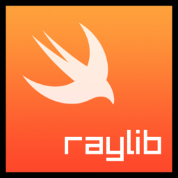

Swift bindings for [raylib](http://www.raylib.com/), **a simple and easy-to-use library to enjoy videogames programming.**

> *NOTE for ADVENTURERS: raylib is a programming library to enjoy videogames programming; no fancy interface, no visual helpers, no debug button... just coding in the most pure spartan-programmers way.*
>
> ~[raysan5](https://github.com/raysan5/raylib)

[](https://github.com/Lancelotbronner/SwiftRaylib/graphs/contributors)
[](https://github.com/Lancelotbronner/SwiftRaylib/releases)
[](https://github.com/Lancelotbronner/SwiftRaylib/commits/master)

<br>

# Swift Raylib

A swifty interface and app lifecycle to ease development with raylib!

## Features

- Swifty interface and compatibility with the latest features!
- Support for `@main` lifecycle
- Decent examples collection with [+16 code examples][examples]!

## Minimal Example

```swift
import Raylib

@main struct BasicWindow: Applet {
	
	init() {
		Window.create(800, by: 450, title: "Example - Core - Basic Window")
	}
	
	func draw() {
		Renderer2D.text(center: "Congrats! You created your first window!", color: Color.lightGray)
	}

}
```


## 🚀 Getting Started

First you'll need to [install raylib as a system library](Raylib/README.md#install-raylib) and [add this package as a dependency](Raylib/README.md#add-swiftraylib-as-a-dependency).

You can then start learning! Check out the [examples] to quickly get an idea and make sure your installation works!

Documentation is available via DocC. For Xcode users simply go to `Product > Build Documentation` or press `⌃⇧⌘D`. For others the documentation is available in the [releases](https://github.com/Lancelotbronner/SwiftRaylib/releases) as a website you can run locally.

[examples]: Examples/README.md